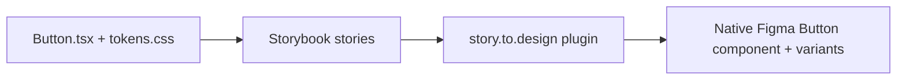

# Connecting the code to Figma

This document explains how the coded `Button` is rendered into Figma as a real,
native Figma component, using only free tools (works on a free Figma plan).

## Why story.to.design (and not Code Connect)

Figma has an official feature called **Code Connect**, but it is **not usable on
a free plan**: it requires an Organization/Enterprise plan with a paid Dev or
Full seat, and it only shows code snippets inside Dev Mode rather than drawing
the component. So it does not "render" the button and is unavailable to us.

Instead we use **[story.to.design](https://story.to.design)**, a free Figma
plugin that reads a Storybook and generates native Figma components (with Figma
variant properties) from the actually-rendered stories. The free tier allows up
to 5 imported components, which is plenty for this Button.



## What the plugin reads

The plugin needs a URL to a running/hosted Storybook. Our stories live in
[`src/components/Button/Button.stories.tsx`](src/components/Button/Button.stories.tsx)
and expose the props as controls, so story.to.design can turn them into Figma
variant properties:

- `variant` -> Primary / Secondary / Tertiary
- `iconName`, `iconPosition`, `iconSize` -> icon states
- `disabled` -> disabled state

## Option A - Local mode (no account needed) — recommended first

Because a free Figma plan can still run community plugins, and story.to.design
can connect to a local Storybook, this is the fastest zero-cost path.

1. Start Storybook locally:
   ```bash
   npm run storybook
   ```
   It serves at `http://localhost:6006`.
2. Open the Figma **desktop app** and create a **new design file** (a free
   Drafts file is fine).
3. Open the plugin: right-click the canvas -> `Plugins` -> `Find more plugins`,
   search **"story.to.design"**, install it, then run it. (Or menu
   `Plugins` -> `story.to.design`.)
4. In the plugin, choose **Local mode / connect to a local Storybook** and enter
   `http://localhost:6006`.
5. The plugin lists the discovered stories. Select **Components/Button** (all its
   stories/variants) and click **Import** / **Generate**.
6. story.to.design creates a native Figma **Button** component with variant
   properties. Verify all three variants and the icon states appear on the
   canvas.

> Note: the plugin runs inside your Figma session, so the final Import click
> happens in your account. Everything on the code side (stories + local server)
> is already prepared by this repo.

## Option B - Hosted Storybook via Chromatic (free public URL)

Use this if you prefer a shareable URL instead of a local server. Chromatic's
free tier hosts your Storybook.

1. Create a free account at https://www.chromatic.com and add a project (link it
   to this repo). Copy the **project token**.
2. Publish:
   ```bash
   npx chromatic --project-token=<YOUR_CHROMATIC_TOKEN>
   # or, after setting CHROMATIC_PROJECT_TOKEN in your env:
   npm run chromatic
   ```
   Chromatic prints a permanent Storybook URL, e.g.
   `https://<hash>.chromatic.com` (the "View Storybook" link).
3. In Figma, run the **story.to.design** plugin, paste that Storybook URL, select
   **Components/Button**, and click **Import**.

Any other static host works too (`npm run build-storybook` produces
`storybook-static/`, deployable to GitHub Pages, Netlify, Vercel, etc.).

## Keeping Figma in sync

story.to.design remembers the connection. When the component code changes, run
the plugin again and click **Update** to push the latest variants into Figma —
no manual redrawing.

## Next: Tokens Studio (free)

See [TOKENS_STUDIO.md](TOKENS_STUDIO.md) for importing
[`tokens/tokens.json`](tokens/tokens.json) into the free Tokens Studio plugin and
exporting them as Figma variables/styles.
